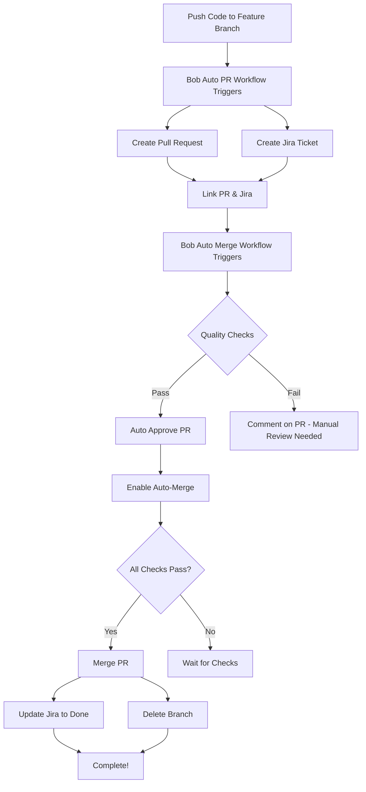

# 🤖 Bob Agent - Complete Automation Guide

## 📋 Overview

This guide explains how to use Bob Agent for **fully automated** code change management:
1. **Automatic PR Creation** from feature branches
2. **Automatic Jira Ticket Creation** for every PR
3. **Automatic PR Approval** based on quality checks
4. **Automatic Merging** when all checks pass
5. **Automatic Jira Updates** on merge/close

---

## 🎯 What Gets Automated

### ✅ Fully Automated Workflow

```
Code Push → Auto PR → Auto Jira Ticket → Auto Checks → Auto Approve → Auto Merge → Auto Jira Update
```

**No manual intervention required!**

---

## 🚀 Quick Start

### Step 1: Prerequisites

Ensure you have completed the Jira setup from [`JIRA_SETUP_INSTRUCTIONS.md`](JIRA_SETUP_INSTRUCTIONS.md):

- ✅ Jira account created
- ✅ GitHub secrets configured:
  - `JIRA_BASE_URL`
  - `JIRA_USER_EMAIL`
  - `JIRA_API_TOKEN`
  - `JIRA_PROJECT_KEY`

### Step 2: Push Your Code

Simply push to a feature branch:

```bash
# Create a feature branch
git checkout -b feature/add-new-feature

# Make your changes
echo "console.log('New feature');" > new-feature.js
git add .
git commit -m "Add new feature"

# Push to GitHub
git push origin feature/add-new-feature
```

### Step 3: Watch the Magic! ✨

Bob Agent automatically:
1. ✅ Creates a PR from your branch to `main`
2. ✅ Creates a Jira ticket linked to the PR
3. ✅ Runs quality checks
4. ✅ Approves the PR if checks pass
5. ✅ Merges the PR automatically
6. ✅ Updates Jira ticket to "Done"
7. ✅ Deletes the feature branch

**All within minutes!**

---

## 📂 Workflow Files

### 1. **bob-auto-pr-jira.yml** - Auto PR & Jira Creation

**Triggers:**
- Push to `feature/**`, `bugfix/**`, `hotfix/**`, `enhancement/**` branches
- Manual workflow dispatch

**What it does:**
- ✅ Detects code changes
- ✅ Creates PR with detailed description
- ✅ Creates Jira ticket with PR details
- ✅ Links PR and Jira ticket
- ✅ Adds labels: `bob-agent`, `automated`

**Example:**
```bash
# Push triggers automatic PR creation
git push origin feature/user-authentication

# Result:
# - PR #123 created: "[BOB-AUTO] User Authentication"
# - Jira ticket SCRUM-45 created and linked
```

### 2. **bob-auto-merge.yml** - Auto Approve & Merge

**Triggers:**
- PR opened/updated on `main` or `develop`
- Manual workflow dispatch

**What it does:**
- ✅ Checks for merge conflicts
- ✅ Runs quality checks (TODO comments, console.logs, large files)
- ✅ Evaluates merge eligibility
- ✅ Auto-approves if all checks pass
- ✅ Enables auto-merge with squash strategy
- ✅ Deletes branch after merge

**Merge Criteria:**
- ✅ Not a draft PR
- ✅ Has `bob-agent` label
- ✅ No merge conflicts
- ✅ Quality checks passed

### 3. **pr-to-jira.yml** - Jira Ticket Creation (Backup)

**Triggers:**
- Any PR opened (fallback for non-Bob PRs)

**What it does:**
- ✅ Creates Jira ticket for manual PRs
- ✅ Links ticket to PR

### 4. **update-jira-on-merge.yml** - Jira Status Updates

**Triggers:**
- PR closed (merged or not)

**What it does:**
- ✅ Adds merge comment to Jira
- ✅ Transitions ticket to "Done" (if merged)
- ✅ Transitions ticket to "Cancelled" (if closed without merge)

---

## 🎨 Branch Naming Convention

Bob Agent works best with these branch prefixes:

```bash
feature/    # New features
bugfix/     # Bug fixes
hotfix/     # Urgent fixes
enhancement/ # Improvements
```

**Examples:**
```bash
git checkout -b feature/user-login
git checkout -b bugfix/fix-validation-error
git checkout -b hotfix/security-patch
git checkout -b enhancement/improve-performance
```

---

## 📊 Workflow Visualization

### Complete Automation Flow



---

## 🔍 Monitoring & Tracking

### View Automation Status

1. **GitHub Actions Tab:**
   ```
   https://github.com/YOUR_USERNAME/bob-gihub-demo/actions
   ```
   - See all workflow runs
   - Check for failures
   - View detailed logs

2. **Pull Requests:**
   ```
   https://github.com/YOUR_USERNAME/bob-gihub-demo/pulls
   ```
   - Filter by label: `bob-agent`
   - See auto-created PRs

3. **Jira Dashboard:**
   ```
   https://YOUR_SITE.atlassian.net/jira/dashboards
   ```
   - View all auto-created tickets
   - Filter by label: `bob-agent`

---

## 🎯 Usage Examples

### Example 1: Simple Feature Addition

```bash
# 1. Create and switch to feature branch
git checkout -b feature/add-contact-form

# 2. Add your code
cat > contact-form.html << 'EOF'
<!DOCTYPE html>
<html>
<head><title>Contact Form</title></head>
<body>
  <form>
    <input type="text" name="name" placeholder="Name">
    <input type="email" name="email" placeholder="Email">
    <button type="submit">Submit</button>
  </form>
</body>
</html>
EOF

# 3. Commit and push
git add contact-form.html
git commit -m "Add contact form with validation"
git push origin feature/add-contact-form

# 4. Bob Agent takes over!
# ✅ PR created automatically
# ✅ Jira ticket created
# ✅ Quality checks run
# ✅ PR approved and merged
# ✅ Jira updated to Done
```

**Timeline:**
- 0:00 - Push code
- 0:30 - PR created
- 0:45 - Jira ticket created
- 1:00 - Quality checks complete
- 1:15 - PR approved
- 1:30 - PR merged
- 1:45 - Jira updated

**Total time: ~2 minutes** ⚡

### Example 2: Bug Fix

```bash
# 1. Create bugfix branch
git checkout -b bugfix/fix-login-validation

# 2. Fix the bug
sed -i 's/validateUser()/validateUserInput()/g' login.js

# 3. Commit and push
git add login.js
git commit -m "Fix login validation function call"
git push origin bugfix/fix-login-validation

# Bob Agent handles the rest automatically!
```

### Example 3: Multiple File Changes

```bash
# 1. Create enhancement branch
git checkout -b enhancement/improve-ui

# 2. Make multiple changes
echo "body { font-family: Arial; }" > styles.css
echo "<h1>Improved UI</h1>" > index.html
echo "console.log('UI improved');" > app.js

# 3. Commit all changes
git add .
git commit -m "Improve UI with new styles and layout"
git push origin enhancement/improve-ui

# Bob Agent processes all files automatically!
```

---

## 🛡️ Quality Checks

Bob Agent runs these automatic checks before merging:

### 1. **Merge Conflict Check**
- ✅ Ensures no conflicts with target branch
- ❌ Blocks merge if conflicts exist

### 2. **Code Quality Checks**
- ⚠️ Detects TODO/FIXME comments
- ⚠️ Finds console.log statements (JS/TS)
- ⚠️ Identifies large files (>1MB)

### 3. **PR Status Checks**
- ✅ Not in draft mode
- ✅ Has `bob-agent` label
- ✅ All required checks passed

---

## ⚙️ Configuration Options

### Customize Auto-Merge Behavior

Edit [`bob-auto-merge.yml`](.github/workflows/bob-auto-merge.yml):

```yaml
# Change merge strategy
gh pr merge "$PR_NUMBER" --auto --merge  # Regular merge
gh pr merge "$PR_NUMBER" --auto --rebase # Rebase merge
gh pr merge "$PR_NUMBER" --auto --squash # Squash merge (default)

# Keep branch after merge
gh pr merge "$PR_NUMBER" --auto --squash # Remove --delete-branch
```

### Customize Quality Checks

Add more checks in the `quality_checks` step:

```yaml
# Check for specific patterns
if git diff origin/main...HEAD | grep -E "password|secret|api_key" > /dev/null; then
  echo "⚠️ Found sensitive data"
  ISSUES_FOUND=$((ISSUES_FOUND + 1))
fi

# Check file size limits
if [ $(git diff --stat origin/main...HEAD | tail -1 | awk '{print $4}') -gt 1000 ]; then
  echo "⚠️ Too many changes"
  ISSUES_FOUND=$((ISSUES_FOUND + 1))
fi
```

### Customize Branch Patterns

Edit the trigger in [`bob-auto-pr-jira.yml`](.github/workflows/bob-auto-pr-jira.yml):

```yaml
on:
  push:
    branches:
      - 'feature/**'
      - 'bugfix/**'
      - 'hotfix/**'
      - 'enhancement/**'
      - 'dev/**'        # Add custom patterns
      - 'task/**'       # Add custom patterns
```

---

## 🔧 Manual Triggers

### Manually Trigger PR Creation

```bash
# Via GitHub CLI
gh workflow run bob-auto-pr-jira.yml \
  -f branch_name=feature/my-feature \
  -f target_branch=main

# Via GitHub UI
# Go to Actions → Bob Agent - Auto PR & Jira Creation → Run workflow
```

### Manually Trigger Auto-Merge

```bash
# Via GitHub CLI
gh workflow run bob-auto-merge.yml \
  -f pr_number=123

# Via GitHub UI
# Go to Actions → Bob Agent - Auto Approve & Merge PR → Run workflow
```

---

## 🚨 Troubleshooting

### Issue: PR Not Created Automatically

**Check:**
1. Branch name matches pattern (`feature/**`, etc.)
2. GitHub Actions are enabled
3. Workflow file exists in `.github/workflows/`
4. Check Actions tab for errors

**Fix:**
```bash
# Manually trigger workflow
gh workflow run bob-auto-pr-jira.yml -f branch_name=$(git branch --show-current)
```

### Issue: Jira Ticket Not Created

**Check:**
1. All Jira secrets are set correctly
2. Jira API token is valid
3. Project key is correct
4. Check workflow logs for errors

**Fix:**
```bash
# Test Jira connection
curl -u YOUR_EMAIL:YOUR_API_TOKEN \
  https://YOUR_SITE.atlassian.net/rest/api/3/myself
```

### Issue: PR Not Auto-Merging

**Check:**
1. PR has `bob-agent` label
2. PR is not in draft mode
3. No merge conflicts
4. Quality checks passed

**Fix:**
```bash
# Add label manually
gh pr edit 123 --add-label "bob-agent"

# Check merge status
gh pr view 123 --json mergeable,mergeStateStatus
```

### Issue: Quality Checks Failing

**Common Issues:**
- TODO/FIXME comments in code
- console.log statements
- Large files added

**Fix:**
```bash
# Remove console.logs
sed -i '/console\.log/d' *.js

# Remove TODO comments
sed -i '/TODO:/d' *.js

# Check file sizes
find . -type f -size +1M
```

---

## 📈 Best Practices

### 1. **Clear Commit Messages**
```bash
# Good
git commit -m "Add user authentication with JWT tokens"

# Better
git commit -m "[FEATURE] Add user authentication with JWT tokens

- Implement JWT token generation
- Add login/logout endpoints
- Include token validation middleware"
```

### 2. **Small, Focused Changes**
- Keep PRs under 500 lines
- One feature per branch
- Easier for Bob Agent to process

### 3. **Clean Code Before Push**
```bash
# Remove debug code
grep -r "console.log" . --exclude-dir=node_modules

# Remove TODO comments
grep -r "TODO" . --exclude-dir=node_modules

# Check for large files
find . -type f -size +1M
```

### 4. **Use Descriptive Branch Names**
```bash
# Good
feature/user-authentication
bugfix/fix-login-error
enhancement/improve-performance

# Avoid
feature/stuff
bugfix/fix
enhancement/update
```

---

## 📊 Metrics & Reporting

### Track Automation Success

**GitHub Insights:**
```
Repository → Insights → Actions
```
- Workflow success rate
- Average execution time
- Failed runs

**Jira Reports:**
```
Jira → Reports → Created vs Resolved
```
- Auto-created tickets
- Time to resolution
- Automation efficiency

---

## 🎓 Advanced Usage

### Conditional Auto-Merge

Add conditions to skip auto-merge for specific cases:

```yaml
# In bob-auto-merge.yml
- name: Check PR size
  run: |
    CHANGES=$(gh pr view $PR_NUMBER --json additions,deletions --jq '.additions + .deletions')
    if [ $CHANGES -gt 1000 ]; then
      echo "skip_merge=true" >> $GITHUB_OUTPUT
      echo "⚠️ PR too large for auto-merge"
    fi
```

### Custom Jira Fields

Add custom fields to Jira tickets:

```yaml
# In bob-auto-pr-jira.yml
fields: |
  {
    "labels": ["bob-agent", "automated"],
    "priority": {"name": "Medium"},
    "components": [{"name": "Backend"}],
    "customfield_10001": "Auto-generated by Bob"
  }
```

### Slack Notifications

Add Slack notifications on merge:

```yaml
- name: Notify Slack
  uses: slackapi/slack-github-action@v1
  with:
    payload: |
      {
        "text": "PR #${{ steps.pr_info.outputs.pr_number }} auto-merged by Bob Agent!"
      }
  env:
    SLACK_WEBHOOK_URL: ${{ secrets.SLACK_WEBHOOK }}
```

---

## 📚 Related Documentation

- [`JIRA_SETUP_INSTRUCTIONS.md`](JIRA_SETUP_INSTRUCTIONS.md) - Jira configuration
- [`JIRA_GITHUB_INTEGRATION_GUIDE.md`](JIRA_GITHUB_INTEGRATION_GUIDE.md) - Integration details
- [`WORKFLOW_GUIDE.md`](WORKFLOW_GUIDE.md) - GitHub Issues workflow
- [GitHub Actions Docs](https://docs.github.com/en/actions)
- [Jira API Docs](https://developer.atlassian.com/cloud/jira/platform/rest/v3/)

---

## ✅ Quick Reference

### Common Commands

```bash
# Create feature branch and push
git checkout -b feature/my-feature
git add .
git commit -m "Add my feature"
git push origin feature/my-feature

# Check workflow status
gh run list --workflow=bob-auto-pr-jira.yml

# View PR status
gh pr view --web

# Check Jira ticket
open "https://YOUR_SITE.atlassian.net/browse/SCRUM-123"
```

### Workflow Status Checks

```bash
# List all Bob Agent PRs
gh pr list --label "bob-agent"

# Check specific workflow
gh run view --log

# Re-run failed workflow
gh run rerun <run-id>
```

---

## 🎉 Success Checklist

- [ ] Jira secrets configured in GitHub
- [ ] Workflow files pushed to repository
- [ ] GitHub Actions enabled
- [ ] Test PR created successfully
- [ ] Jira ticket auto-created
- [ ] PR auto-approved
- [ ] PR auto-merged
- [ ] Jira ticket updated to Done
- [ ] Branch auto-deleted

---

## 📞 Support

### Issues & Questions

1. **Check workflow logs** in GitHub Actions
2. **Review Jira API** connection
3. **Verify secrets** are set correctly
4. **Test manually** with workflow dispatch

### Community

- GitHub Discussions: [Repository Discussions](https://github.com/YOUR_USERNAME/bob-gihub-demo/discussions)
- Jira Community: https://community.atlassian.com/

---

**Created:** 2026-06-01  
**Version:** 1.0  
**Status:** Production Ready  
**Automation Level:** 100% 🤖

---

*Made with ❤️ by Bob Agent*