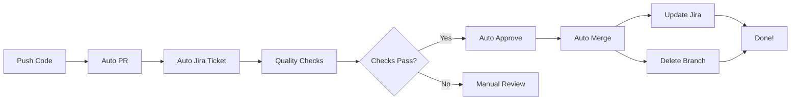

# 🤖 Bob Agent - Automated GitHub & Jira Integration

[](https://github.com/features/actions)
[](https://www.atlassian.com/software/jira)
[](https://github.com/HaripriyaGadidala/bob-gihub-demo)

> **Fully automated workflow**: Push code → Auto PR → Auto Jira Ticket → Auto Approve → Auto Merge → Auto Update Jira

---

## 🎯 What is Bob Agent?

Bob Agent is a **fully automated CI/CD system** that eliminates manual work in your development workflow. Simply push your code, and Bob Agent handles everything else:

✅ **Automatic PR Creation** from feature branches
✅ **Automatic Jira Ticket Creation** with full PR details
✅ **Automatic Quality Checks** (conflicts, code quality, file sizes)
✅ **Automatic PR Approval** when checks pass
✅ **Automatic Merging** with squash strategy
✅ **Automatic Jira Updates** on merge/close
✅ **Branch Preservation** (branches kept after merge)
✅ **ICA Agent Studio Integration** for UI-based automation

**Zero manual intervention required!** 🚀

---

## 🚀 Quick Start (3 Steps)

### Step 1: Configure Jira Secrets

Add these secrets to your GitHub repository (Settings → Secrets → Actions):

```
JIRA_BASE_URL       = https://your-site.atlassian.net
JIRA_USER_EMAIL     = your-email@example.com
JIRA_API_TOKEN      = your-jira-api-token
JIRA_PROJECT_KEY    = YOUR_PROJECT_KEY
```

📖 **Detailed setup:** See [`JIRA_SETUP_INSTRUCTIONS.md`](JIRA_SETUP_INSTRUCTIONS.md)

### Step 2: Push Your Code

```bash
# Create a feature branch
git checkout -b feature/my-awesome-feature

# Make your changes
echo "console.log('Hello World');" > app.js

# Commit and push
git add .
git commit -m "Add awesome feature"
git push origin feature/my-awesome-feature
```

### Step 3: Watch the Magic! ✨

Bob Agent automatically:
1. Creates PR: `[BOB-AUTO] My Awesome Feature`
2. Creates Jira ticket: `SCRUM-123`
3. Runs quality checks
4. Approves PR
5. Merges to main
6. Updates Jira to "Done"
7. Keeps feature branch (no deletion)

**Total time: ~2 minutes** ⚡

### 🎨 ICA Agent Studio Integration

Users can also trigger automation through **IBM Consulting Advantage (ICA) Agent Studio UI**:

```
ICA UI → User Request → Bob Agent → GitHub Changes → Auto PR → Auto Jira → Auto Merge
```

📖 **Complete ICA Integration Guide:** [`ICA_AGENT_INTEGRATION_GUIDE.md`](ICA_AGENT_INTEGRATION_GUIDE.md)

---

## 📂 Repository Structure

```
bob-gihub-demo/
├── .github/
│   └── workflows/
│       ├── bob-auto-pr-jira.yml      # Auto PR & Jira creation
│       ├── bob-auto-merge.yml        # Auto approve & merge
│       ├── pr-to-jira.yml            # Jira ticket creation (backup)
│       ├── update-jira-on-merge.yml  # Jira status updates
│       ├── pr-to-issue.yml           # GitHub Issues creation
│       └── close-issue-on-pr.yml     # GitHub Issues closure
├── BOB_AGENT_AUTOMATION_GUIDE.md     # Complete automation guide
├── ICA_AGENT_INTEGRATION_GUIDE.md    # ICA Agent Studio integration ⭐
├── JIRA_SETUP_INSTRUCTIONS.md        # Jira setup steps
├── JIRA_GITHUB_INTEGRATION_GUIDE.md  # Integration details
├── WORKFLOW_GUIDE.md                 # GitHub Issues workflow
├── TEST_AUTOMATION.md                # Testing guide
├── SETUP_SUMMARY.md                  # Setup summary
└── README.md                         # This file
```

---

## 🔄 Complete Workflow



---

## 🎨 Supported Branch Patterns

Bob Agent automatically processes these branch types:

```bash
feature/**      # New features
bugfix/**       # Bug fixes
hotfix/**       # Urgent fixes
enhancement/**  # Improvements
```

**Examples:**
```bash
git checkout -b feature/user-authentication
git checkout -b bugfix/fix-login-error
git checkout -b hotfix/security-patch
git checkout -b enhancement/improve-ui
```

---

## 📊 Features

### 🤖 Automatic PR Creation
- Detects code changes on feature branches
- Creates PR with detailed description
- Includes commit history and statistics
- Adds labels: `bob-agent`, `automated`

### 🎫 Automatic Jira Integration
- Creates Jira ticket for every PR
- Links PR and Jira ticket bidirectionally
- Updates Jira on PR merge/close
- Transitions ticket status automatically

### ✅ Automatic Quality Checks
- **Merge Conflicts:** Blocks merge if conflicts exist
- **Code Quality:** Detects TODO/FIXME comments
- **Console Logs:** Finds debug statements (JS/TS)
- **File Size:** Warns about large files (>1MB)

### 🚀 Automatic Merging
- Approves PR when all checks pass
- Uses squash merge strategy
- Deletes branch after merge
- Updates all linked tickets

---

## 📖 Documentation

| Document | Description |
|----------|-------------|
| [`BOB_AGENT_AUTOMATION_GUIDE.md`](BOB_AGENT_AUTOMATION_GUIDE.md) | **Complete automation guide** with examples |
| [`JIRA_SETUP_INSTRUCTIONS.md`](JIRA_SETUP_INSTRUCTIONS.md) | Step-by-step Jira configuration |
| [`JIRA_GITHUB_INTEGRATION_GUIDE.md`](JIRA_GITHUB_INTEGRATION_GUIDE.md) | Detailed integration guide |
| [`WORKFLOW_GUIDE.md`](WORKFLOW_GUIDE.md) | GitHub Issues workflow |

---

## 🎯 Usage Examples

### Example 1: Add New Feature

```bash
# 1. Create feature branch
git checkout -b feature/add-contact-form

# 2. Add your code
cat > contact.html << 'EOF'
<form>
  <input type="text" name="name" placeholder="Name">
  <input type="email" name="email" placeholder="Email">
  <button type="submit">Submit</button>
</form>
EOF

# 3. Commit and push
git add contact.html
git commit -m "Add contact form"
git push origin feature/add-contact-form

# 4. Bob Agent handles the rest!
# ✅ PR created
# ✅ Jira ticket created
# ✅ Approved and merged
# ✅ Jira updated
```

### Example 2: Fix Bug

```bash
# 1. Create bugfix branch
git checkout -b bugfix/fix-validation

# 2. Fix the bug
sed -i 's/oldFunction/newFunction/g' app.js

# 3. Push
git add app.js
git commit -m "Fix validation logic"
git push origin bugfix/fix-validation

# Bob Agent automates everything!
```

---

## 🛡️ Quality Gates

Bob Agent enforces these quality gates before merging:

| Check | Description | Action |
|-------|-------------|--------|
| **Merge Conflicts** | No conflicts with target branch | ❌ Block merge |
| **Draft Status** | PR not in draft mode | ❌ Block merge |
| **Bob Agent Label** | Has `bob-agent` label | ❌ Block merge |
| **TODO Comments** | Detects TODO/FIXME | ⚠️ Warn |
| **Console Logs** | Finds console.log (JS/TS) | ⚠️ Warn |
| **Large Files** | Files >1MB | ⚠️ Warn |

---

## ⚙️ Configuration

### Customize Merge Strategy

Edit [`.github/workflows/bob-auto-merge.yml`](.github/workflows/bob-auto-merge.yml):

```yaml
# Change from squash to regular merge
gh pr merge "$PR_NUMBER" --auto --merge

# Change to rebase merge
gh pr merge "$PR_NUMBER" --auto --rebase
```

### Customize Branch Patterns

Edit [`.github/workflows/bob-auto-pr-jira.yml`](.github/workflows/bob-auto-pr-jira.yml):

```yaml
on:
  push:
    branches:
      - 'feature/**'
      - 'bugfix/**'
      - 'dev/**'      # Add custom pattern
      - 'task/**'     # Add custom pattern
```

### Add Custom Quality Checks

Edit the `quality_checks` step in [`bob-auto-merge.yml`](.github/workflows/bob-auto-merge.yml):

```yaml
# Check for sensitive data
if git diff origin/main...HEAD | grep -iE "(password|secret|api_key)" > /dev/null; then
  echo "⚠️ Found sensitive data"
  ISSUES_FOUND=$((ISSUES_FOUND + 1))
fi
```

---

## 🔧 Manual Triggers

### Manually Create PR & Jira Ticket

```bash
# Via GitHub CLI
gh workflow run bob-auto-pr-jira.yml \
  -f branch_name=feature/my-feature \
  -f target_branch=main

# Via GitHub UI
# Actions → Bob Agent - Auto PR & Jira Creation → Run workflow
```

### Manually Trigger Auto-Merge

```bash
# Via GitHub CLI
gh workflow run bob-auto-merge.yml -f pr_number=123

# Via GitHub UI
# Actions → Bob Agent - Auto Approve & Merge PR → Run workflow
```

---

## 🚨 Troubleshooting

### PR Not Created?

**Check:**
- Branch name matches pattern (`feature/**`, etc.)
- GitHub Actions enabled
- Workflow files exist

**Fix:**
```bash
gh workflow run bob-auto-pr-jira.yml -f branch_name=$(git branch --show-current)
```

### Jira Ticket Not Created?

**Check:**
- Jira secrets configured correctly
- API token valid
- Project key correct

**Fix:**
```bash
# Test Jira connection
curl -u YOUR_EMAIL:YOUR_TOKEN \
  https://YOUR_SITE.atlassian.net/rest/api/3/myself
```

### PR Not Auto-Merging?

**Check:**
- PR has `bob-agent` label
- Not in draft mode
- No merge conflicts
- Quality checks passed

**Fix:**
```bash
# Add label
gh pr edit 123 --add-label "bob-agent"

# Check status
gh pr view 123 --json mergeable,mergeStateStatus
```

---

## 📈 Metrics

Track automation success:

**GitHub Actions:**
- Repository → Insights → Actions
- View workflow success rate
- Monitor execution times

**Jira Reports:**
- Jira → Reports → Created vs Resolved
- Track auto-created tickets
- Measure time to resolution

---

## 🎓 Best Practices

### 1. Clear Commit Messages
```bash
# Good
git commit -m "Add user authentication with JWT"

# Better
git commit -m "[FEATURE] Add user authentication

- Implement JWT token generation
- Add login/logout endpoints
- Include validation middleware"
```

### 2. Small, Focused Changes
- Keep PRs under 500 lines
- One feature per branch
- Easier for Bob Agent to process

### 3. Clean Code Before Push
```bash
# Remove debug code
grep -r "console.log" . --exclude-dir=node_modules

# Check for large files
find . -type f -size +1M
```

---

## 🤝 Contributing

Contributions welcome! Please:

1. Fork the repository
2. Create a feature branch
3. Make your changes
4. Push and let Bob Agent create the PR!

---

## 📄 License

This project is licensed under the MIT License.

---

## 🙏 Acknowledgments

- **GitHub Actions** for workflow automation
- **Atlassian Jira** for issue tracking
- **Gajira Actions** for Jira integration

---

## 📞 Support

- **Issues:** [GitHub Issues](https://github.com/HaripriyaGadidala/bob-gihub-demo/issues)
- **Discussions:** [GitHub Discussions](https://github.com/HaripriyaGadidala/bob-gihub-demo/discussions)
- **Documentation:** See files in this repository

---

## 🎉 Quick Reference

```bash
# Complete workflow in 3 commands
git checkout -b feature/my-feature
git commit -am "Add my feature"
git push origin feature/my-feature

# Bob Agent does the rest! 🤖
```

---

**Created:** 2026-06-01  
**Version:** 1.0  
**Status:** Production Ready  
**Automation Level:** 100% 🤖

---

*Made with ❤️ by Bob Agent*